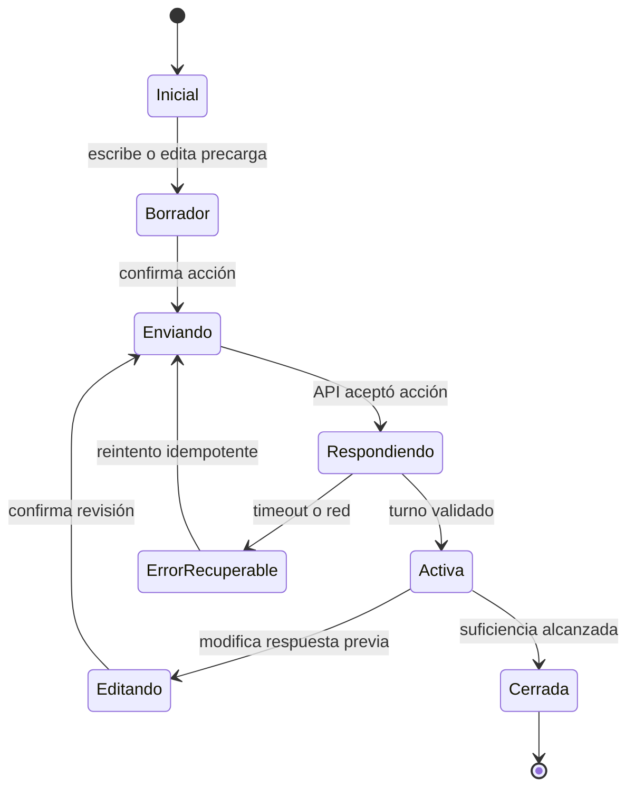

# Diseño y experiencia de la conversación de Socies

**Estado:** especificación funcional de UI para implementación y validación visual  
**Fuente visual canónica:** `docs/ux/design-system.md`

## 1. Objetivo

La conversación reemplaza el formulario tradicional por una experiencia breve que:

1. entiende la consulta;
2. evita volver a pedir datos ya disponibles;
3. muestra evidencia real de Socies cuando aporta confianza;
4. reúne solo la información necesaria para evaluar el caso;
5. cierra cordialmente y confirma que el equipo se pondrá en contacto.

“Paco” es el nombre interno del producto. Para el visitante, quien conversa es Socies.

## 2. Principios de experiencia

- Socies habla siempre como “nosotros”.
- Una sola pregunta principal por turno.
- La conversación termina cuando alcanza suficiencia; no busca maximizar interacciones.
- La interfaz se siente cercana a mensajería por ritmo y estructura, sin copiar WhatsApp.
- La estrategia comercial, los componentes y el cierre los controla el backend.
- Cada turno puede combinar un mensaje breve, una evidencia y un único objetivo de interacción.
- Todo dato precargado puede revisarse.
- El visitante no ve score, inferencias, playbook ni clasificación interna.

## 3. Puntos de entrada

### 3.1 Home

La conversación aparece inline después de la sección de logos de clientes.

- Comparte fondo negro con la home.
- El CTA “Contanos tu problema” desplaza hasta la conversación cuando el usuario está en home.
- Puede comenzar vacía o con contexto de la página/campaña.
- Debe cargarse de forma diferida cuando aún está fuera del viewport.

### 3.2 Ruta propia

La misma experiencia tiene una URL propia para campañas, enlaces directos y continuidad.

Ruta conceptual:

```text
/hablemos
```

El nombre definitivo de la ruta puede ajustarse antes de implementar, pero debe existir una sola ruta pública canónica.

Casos:

- campaña de email con destinatario conocido;
- anuncio de Facebook dirigido a una necesidad concreta;
- CTA desde una solución o trabajo;
- enlace directo genérico;
- reanudación desde el mismo navegador.

No se contempla un widget flotante en el MVP.

## 4. Contrato de campañas y precarga

### 4.1 Parámetros públicos no sensibles

La URL puede incluir:

```text
campaign
intent
source
utm_source
utm_medium
utm_campaign
page_context
```

Estos valores son indicios. El backend debe validarlos contra campañas e intenciones publicadas y nunca tratarlos como instrucciones libres para el modelo.

### 4.2 Nombre, email y consulta inicial

Nombre, email y consulta inicial no deben exponerse como texto plano en una URL de producción. Las URLs se copian, quedan en historial, pueden llegar a analytics y pueden filtrarse mediante `Referer`.

Para precargarlos se utiliza:

```text
/hablemos?campaign=landing-ong&prefill_token=<opaque-token>
```

El token referencia en caché un payload validado:

```json
{
  "name": "Ana",
  "email": "ana@example.com",
  "initial_query": "Necesitamos una landing para una campaña",
  "campaign": "landing-ong",
  "intent": "landing_page"
}
```

Reglas:

- token aleatorio u opaco, no un JWT con PII legible;
- TTL configurable y corto;
- asociado a campaña y origen permitido;
- lectura limitada y auditable;
- invalidación después de crear la conversación o al vencer;
- los valores se muestran como precarga editable, no como respuesta confirmada;
- una vez aceptados, pasan a eventos y atributos persistidos;
- el navegador elimina el token visible mediante navegación canónica o `history.replaceState`;
- analytics no recibe el token ni el contenido precargado.

Para desarrollo local puede existir una precarga directa explícitamente deshabilitada en producción.

### 4.3 Caché y persistencia

Se distinguen tres estados:

1. **Precarga de campaña:** caché del servidor asociada a `prefill_token`.
2. **Borrador aún no enviado:** `sessionStorage` opcional para la consulta inicial; nunca email o teléfono.
3. **Conversación creada:** PostgreSQL es la fuente de verdad. El navegador conserva solo ID, token opaco y versión.

La consulta inicial precargada debe sobrevivir a un refresh mientras sea un borrador válido. Al enviarla se persiste como evento y se elimina el borrador local.

## 5. Inicio según contexto

### Sin precarga

Socies muestra:

> ¿En qué podemos ayudarte?

Con un campo libre visible.

### Con intención o campaña

El mensaje puede adaptarse mediante contenido aprobado de campaña, manteniendo una pregunta abierta y breve. La campaña orienta el playbook, pero el usuario puede describir otra necesidad.

### Con consulta inicial precargada

- Mostrar la consulta dentro del composer antes de enviarla.
- Permitir editarla.
- No ejecutar análisis ni crear hechos hasta que el visitante la confirme.

### Con contacto precargado

- Mostrar nombre y canal de contacto para revisión antes de usarlos.
- No volver a pedir datos válidos ya confirmados.
- Si el dato es inválido o venció la precarga, pedir corrección sin perder la consulta.

## 6. Anatomía de la interfaz

```text
SociesConversation
├── ConversationHeader
│   ├── identificación “Socies”
│   └── estado accesible
├── MessageViewport
│   ├── AssistantTurn
│   ├── UserTurn
│   ├── KnowledgeCard
│   └── StatusAnnouncer
├── TurnControls
│   ├── opciones rápidas
│   ├── inputs estructurados
│   └── formularios breves
├── ComposerArea
└── ConversationActions
    ├── editar respuesta
    └── reintentar cuando corresponde
```

No mostrar progreso porcentual ni cantidad fija de pasos: el recorrido es dinámico.

## 7. Mensajes

### Mensajes de Socies

- alineados a la izquierda;
- fondo negro;
- texto blanco;
- borde verde Socies;
- ancho de lectura contenido;
- sin avatar de Paco;
- etiqueta “Socies” solo cuando ayude a orientar, no repetida en cada globo.

### Mensajes del visitante

- alineados a la derecha;
- fondo coral/rosa Socies;
- texto blanco;
- conservan exactamente el valor confirmado por el usuario;
- respuestas estructuradas se muestran con su label humano, no con códigos internos.

### Contenido y longitud

- máximo una pregunta principal por turno;
- confirmación breve antes de preguntar;
- separar cada párrafo mediante un salto de línea real;
- mostrar la pregunta principal en un renglón propio y con peso tipográfico fuerte;
- listas solo cuando mejoran comprensión;
- no renderizar HTML del modelo;
- Markdown limitado a énfasis, listas breves y enlaces autorizados.

## 8. Componentes permitidos

El renderer acepta una unión discriminada cerrada:

```text
text
buttons
single_select
multi_select
text_input
contact_form
range
slider
date
knowledge_card
content_carousel
testimonial
image
video
```

Para el MVP inicial se implementan solo los tipos requeridos por los playbooks publicados. Un tipo conocido pero todavía no soportado falla de forma visible y segura; nunca ejecuta código recibido.

### Cards de conocimiento

Una `knowledge_card` usa una proyección segura preparada por backend:

```text
service
pack
client
work
testimonial
```

Debe incluir únicamente campos publicables, `chat_enabled` y compatibles con las reglas de encaje. Máximo tres trabajos y un testimonio por turno.

La card de testimonio es compacta:

- avatar de la persona al comienzo, únicamente cuando fue cargado;
- nombre y cargo junto al avatar;
- logo del cliente arriba a la derecha, sin repetir el nombre largo como encabezado;
- cita breve aprobada o primer fragmento exacto;
- enlace “Ver testimonio completo”;
- sin bloques de texto extensos que compitan con la conversación.

### Contacto

El formulario puede reunir:

- nombre;
- canal: email o WhatsApp;
- valor del canal;
- aviso de privacidad y versión del consentimiento cuando corresponda.

Si nombre y contacto llegaron confirmados mediante precarga, el formulario puede convertirse en una revisión compacta en vez de volver a solicitar los campos.

## 9. Flujo visual por estados



### Reglas de transición visual

- Deshabilitar únicamente el control que podría duplicar el envío; mantener visible el contexto.
- No insertar un mensaje optimista como confirmado hasta que la API acepte la acción.
- El indicador “Socies está respondiendo” es breve y se elimina por completo al recibir el turno.
- Ante error recuperable, conservar el borrador y ofrecer reintento.
- En cierre, ocultar controles de respuesta y mostrar confirmación de contacto.

## 10. Edición de respuestas

Volver atrás no reescribe el historial silenciosamente.

- El usuario elige una respuesta propia editable.
- La UI muestra el control correspondiente con el valor anterior.
- El backend registra una revisión append-only.
- Se recalculan atributos, contenido relevante y suficiencia.
- La UI marca la respuesta anterior como actualizada sin mostrar detalles internos.

No permitir editar una campaña o un dato inferido que nunca fue mostrado como respuesta del usuario.

## 11. Cierre

La conversación se cierra apenas existen:

- contacto válido;
- motivo y descripción útil;
- información mínima definida por el playbook;
- un próximo paso razonable.

Antes de cerrar, Socies debe haber sido cordial y haber aportado valor o explicado que no existe evidencia aplicable.

Ejemplo de tono:

> Gracias, Ana. Ya tenemos la información necesaria. Nuestro equipo va a revisar el caso y te va a contactar por WhatsApp.

El cierre:

- no promete fecha de respuesta si no está documentada;
- no revela score o fit;
- no abre una pregunta nueva;
- deja el lead como `pending_review`;
- permite iniciar una conversación nueva solo mediante una acción separada.

## 12. Encaje configurado desde CMS

El modelo no decide libremente qué hace Socies. El CMS clasifica capacidades e intenciones:

```text
supported     Socies lo ofrece y puede mostrar evidencia relacionada
conditional   requiere revisión o condiciones específicas
unsupported   Socies no lo ofrece
unknown       todavía no existe una regla editorial suficiente
```

Comportamiento:

- `supported`: continúa con el playbook y contenido relevante.
- `conditional`: reúne la mínima información que resuelve la condición y cierra a revisión.
- `unsupported`: responde cordialmente con un bloque aprobado; puede ofrecer una alternativa real si está configurada.
- `unknown`: no inventa encaje; reúne contacto y contexto solo si la política editorial lo permite.

Trabajos, servicios, packs y reglas de encaje se cargan desde el CMS. La ausencia de un trabajo publicado no demuestra por sí sola que Socies no realice ese tipo de proyecto.

## 13. Responsive

### Mobile

- La conversación ocupa el ancho disponible con padding del sistema.
- El composer permanece visible sin quedar cubierto por el teclado virtual.
- Opciones largas se apilan.
- Cards se muestran de una en una o en scroll horizontal con controles accesibles.
- Formularios compuestos se presentan en una sola columna.
- Se respetan safe areas.

### Desktop

- El hilo mantiene ancho de lectura contenido.
- El espacio lateral puede alojar contexto o cards solo si no rompe la continuidad del hilo.
- La ruta propia no estira mensajes a todo el viewport.

La lógica, el orden y la cantidad de preguntas son iguales en todos los tamaños.

## 14. Accesibilidad

- Orden DOM cronológico.
- `aria-live="polite"` anuncia solo el turno nuevo y estados relevantes.
- El foco no salta automáticamente al mensaje recibido.
- Controles utilizables mediante teclado.
- Labels y errores asociados semánticamente.
- Al editar, el foco llega al control y vuelve a una posición predecible al confirmar.
- Los globos se distinguen además de por color mediante alineación, borde y etiqueta contextual.
- `prefers-reduced-motion` elimina desplazamientos y apariciones progresivas.

## 15. Rendimiento y carga

- JSON atómico, sin streaming token a token.
- Carga diferida del módulo en home.
- Reutilización del mismo bundle en home y ruta propia.
- Media con dimensiones reservadas y lazy loading.
- La espera nunca se alarga artificialmente.
- Timeout y fallback conservan el mensaje entrante.

## 16. Analítica sin PII

Eventos mínimos:

```text
conversation_viewed
conversation_started
prefill_loaded
prefill_edited
action_submitted
contact_requested
contact_submitted
knowledge_viewed
knowledge_clicked
answer_revised
conversation_closed
api_error
```

No enviar textos, nombre, email, teléfono, `prefill_token` ni transcript a herramientas de terceros.

## 17. Validaciones visuales pendientes

Antes de implementar el acabado final se deben comparar:

1. dos anchos máximos del hilo;
2. dos radios y densidades de globos;
3. coral sólido frente a una variante semántica derivada del mismo token;
4. composer integrado al hilo frente a composer separado;
5. cards inline frente a carrusel en mobile.

Estas pruebas no cambian la arquitectura ni la identidad confirmada.

## 18. Criterios de aceptación de UI

- La home muestra la conversación después de logos.
- La ruta propia acepta campaña y precarga segura.
- La consulta precargada puede editarse y permanece en borrador tras refresh.
- Nombre/email no aparecen en texto plano en la URL de producción.
- Socies habla en plural y no aparece un personaje separado.
- Los mensajes respetan tokens negro, verde y coral.
- Un dato válido precargado no se vuelve a preguntar.
- Cada turno tiene una sola pregunta principal.
- El CMS puede declarar necesidades soportadas, condicionales y no soportadas.
- El cierre ocurre en cuanto el playbook alcanza suficiencia.
- Carga, error, reconexión, edición y cierre son accesibles con teclado.
