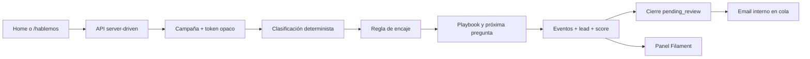

# Implementación actual

**Estado:** vertical mínima ejecutable en desarrollo  
**Fecha:** 2026-07-31

## Vista rápida



## Qué ya funciona

- conversación inline después de los logos de home;
- ruta propia `/hablemos` con campaña, UTMs y precarga privada;
- renderer React para texto, selección única, selección múltiple, fecha y contacto;
- retrieval comercial desde clientes publicados con autorización explícita en cliente y pieza;
- ranking editorial por problema, rubro, tipo de solución y testimonio;
- planificador de evidencia que usa el historial saneado, selecciona hasta tres proyectos comparables y un testimonio, y registra la decisión en `model_runs`;
- composición factual protegida: nombres, títulos, soluciones, resultados, citas y cargos se insertan desde piezas autorizadas del CMS;
- guardia de contexto comercial: el contacto por sí solo no dispara evidencia y las solicitudes genéricas de web reciben una pregunta contextual antes del retrieval;
- preguntas separadas visualmente en un renglón propio y cards de testimonio compactas con avatar y logo opcionales;
- cards React para trabajos y testimonios dentro del hilo, con cliente visible también en el mensaje;
- registro de cada evidencia mostrada en `content_impressions`;
- memoria breve del último motivo sustantivo para referencias y correcciones;
- rescate determinista cuando el proveedor devuelve baja confianza ante una necesidad reconocible;
- selección adaptativa que puede usar preguntas relevantes del catálogo fuera del orden rígido del playbook;
- límites basados en interacciones útiles, con margen separado para seguridad;
- persistencia progresiva append-only, token de conversación, idempotencia y versión optimista;
- clasificación y composición deterministas intercambiables mediante `PacoModelGateway`;
- selección de playbook y preguntas desde datos editables;
- reglas CMS `supported`, `conditional`, `unsupported` y `unknown`;
- cierre breve como `pending_review`, scoring inicial y email interno en cola;
- panel para consultas, campañas, intenciones, playbooks, preguntas, respuestas y alcance;
- generación de enlaces precargados desde el panel o `paco:prefill-link`;
- seeds de bootstrap idempotentes y pruebas de API, CMS, seguridad y notificación.

## Datos iniciales

| Entidad | Cantidad | Administración |
|---|---:|---|
| Intenciones | 14 | CMS |
| Playbooks | 7 | CMS |
| Preguntas | 22 | CMS |
| Respuestas aprobadas | 15 | CMS |
| Reglas de alcance | 14 | CMS |
| Campañas | 5 | CMS |

Solo `home_default` y `direct_default` nacen activas. Las tres campañas segmentadas quedan como borradores para revisar copy, origen y distribución antes de usarlas.

## Tablas

```text
Configuración               Operación                   Conocimiento/observabilidad
intents                     conversations               knowledge_entities
playbooks                   conversation_events         knowledge_chunks
intent_playbook             leads                       content_impressions
questions                   lead_attributes             model_runs
playbook_fields             lead_scores                 security_events
response_blocks
campaigns
service_fit_rules
```

Email y teléfono se almacenan cifrados. La URL precargada contiene un token aleatorio; nombre, contacto y consulta viven temporalmente en caché y se consumen una sola vez.

## Flujo visible

```text
¿En qué podemos ayudarte?
        ↓ texto libre
Socies confirma + pregunta útil
        ↓ respuesta estructurada
Nombre + email o WhatsApp
        ↓ 0–2 preguntas útiles
“Ya tenemos la información necesaria.”
        ↓
pending_review + email + panel
```

## Límites conscientes de esta entrega

La implementación actual cubre la vertical conversacional con un planificador híbrido. OpenCode Go con MiMo V2.5 clasifica la intención, extrae hechos, propone prioridades entre preguntas permitidas y redacta una confirmación breve. En cada respuesta de texto libre posterior, un enrutador estructurado distingue una respuesta válida de una pregunta, corrección, objeción, desvío o texto sin información. Solo una respuesta válida completa el campo y avanza suficiencia; las preguntas y objeciones reciben una respuesta breve generada y mantienen visible la pregunta pendiente. Después del contacto, otro planificador recibe el historial saneado y las piezas autorizadas, elige hasta cuatro elementos y deja la decisión auditada como `model_run` de fase `evidence_composer`; el backend arma el argumento y el carrusel usando hechos literales del CMS. Si falta la clave, el proveedor responde con error de cuota o devuelve un resultado inválido, Paco usa el gateway determinista. Todavía no calcula embeddings ni incluye Turnstile/Cloudflare o revisión completa de correcciones sobre respuestas anteriores.

## Comandos operativos

```bash
php artisan migrate
php artisan db:seed --class=PacoBootstrapSeeder
php artisan queue:work
npm run build
```

Para activar el proveedor, completá `OPENCODE_API_KEY` en `.env`. El modelo configurado es `mimo-v2.5`; `OPENCODE_MAX_TOKENS=1600` permite que modelos con razonamiento interno terminen la respuesta estructurada. Una intención `general` sin hechos y con confianza menor que `PACO_MIN_INTENT_CONFIDENCE` mantiene el flujo en `initial_need` y solicita nuevamente el motivo de consulta. El circuito determinista se reactiva automáticamente después de `PACO_AI_FALLBACK_COOLDOWN_MINUTES`.

Ejemplo de enlace seguro:

```bash
php artisan paco:prefill-link direct_default \
  --name="Ana" \
  --email="ana@ejemplo.com" \
  --query="Necesitamos automatizar una aprobación" \
  --source=email \
  --medium=newsletter
```
